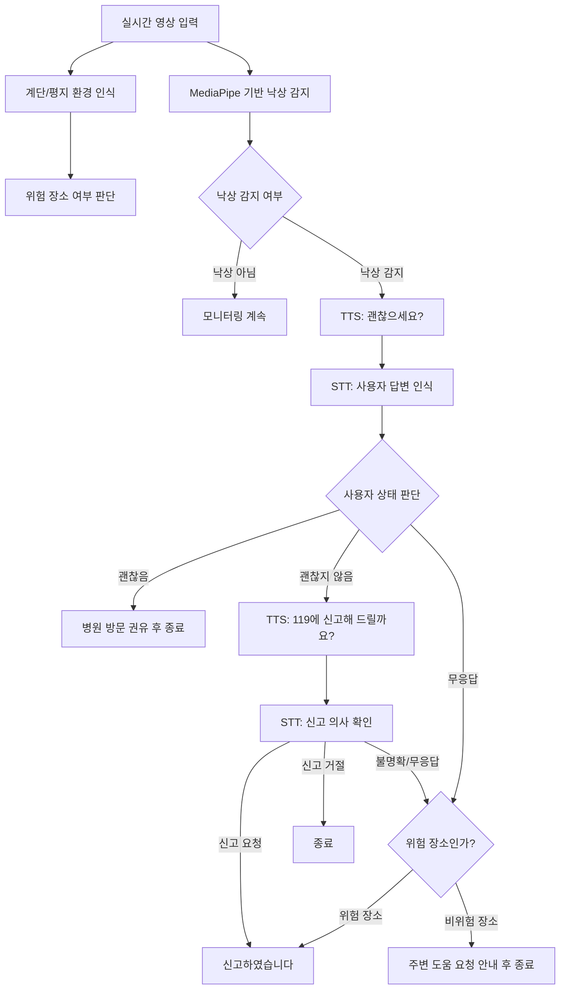

# Stair Fall Emergency Response System

영상 기반 계단 환경 인식, MediaPipe 기반 낙상 감지, STT/TTS 음성 인터랙션을 통합하여 사용자의 낙상 상황을 판단하고 응급 대응 단계를 결정하는 시스템입니다.

## 프로젝트 개요

본 프로젝트는 실시간 영상에서 사용자의 주변 환경과 자세 변화를 분석하여 낙상 여부를 판단하고, 낙상 발생 후 사용자의 음성 응답을 기반으로 응급 신고 여부를 결정하는 것을 목표로 합니다.

주요 기능은 다음과 같습니다.

- ResNet 기반 CNN 전이 학습 모델을 이용한 계단/평지 환경 인식
- MediaPipe Pose를 이용한 신체 주요 좌표 추출 및 낙상 감지
- TTS를 이용한 사용자 상태 확인 음성 출력
- STT를 이용한 사용자 답변 인식 및 텍스트 변환
- 무응답, 예외 응답, 위험 장소 여부를 반영한 응급 대응 단계 결정

## 시스템 흐름



## 담당 기능: STT/TTS 인터랙션

STT/TTS 인터랙션 모듈은 낙상 감지 이후 사용자에게 음성으로 상태를 확인하고, 사용자의 답변을 분석하여 응급 신고 여부를 결정합니다.

### 대화 로직

1. 낙상 감지 시 TTS로 "낙상이 감지되었습니다. 괜찮으세요?"를 출력합니다.
2. STT로 사용자의 답변을 인식합니다.
3. 답변이 괜찮음으로 분류되면 병원 방문을 권유하고 종료합니다.
4. 답변이 괜찮지 않음으로 분류되면 "대신 119에 신고해 드릴까요?"를 출력합니다.
5. 사용자가 신고를 요청하면 신고 처리 단계로 이동합니다.
6. 사용자가 신고를 거절하면 병원 방문을 권유하고 종료합니다.
7. 사용자가 무응답이거나 답변이 불명확한 경우, 계단 등 위험 장소 여부를 확인합니다.
8. 위험 장소라면 자동 신고 처리 단계로 이동하고, 비위험 장소라면 주변 도움 요청 안내 후 종료합니다.

### 응답 분류 기준

| 분류 | 예시 답변 | 처리 |
| --- | --- | --- |
| 괜찮음 | 괜찮아, 안 다쳤어, 안 아파, 바로 일어남 | 병원 방문 권유 후 종료 |
| 괜찮지 않음 | 아니, 아파, 도와줘, 살려줘, 못 움직여 | 신고 의사 재확인 |
| 신고 요청 | 응, 그래, 빨리, 제발, 지금 당장, 신고해줘 | 신고 처리 |
| 신고 거절 | 아니, 하지 마, 필요 없어, 괜찮아 | 종료 |
| 무응답 | 제한 시간 내 답변 없음 | 위험 장소 여부에 따라 자동 신고 또는 종료 |

## 파일 구조

```text
.
├── stt_tts_interaction.py   # STT/TTS 대화 및 응급 대응 판단 모듈
├── main_loop_example.py     # 계단 인식/낙상 감지 모듈과의 통합 예시
├── test_interaction_logic.py # 대화 분기 테스트 코드
├── requirements.txt         # 실행에 필요한 패키지 목록
├── stt_tset.py              # 기존 STT 단독 테스트 파일
└── tts.test.py              # 기존 TTS 단독 테스트 파일
```

## 실행 방법

### 1. 패키지 설치

```bash
pip install -r requirements.txt
```

마이크 입력을 사용하려면 PyAudio 설치가 필요합니다. 운영체제나 Python 환경에 따라 PyAudio 설치 과정이 다를 수 있습니다.

### 2. 콘솔 테스트 모드

마이크 없이 키보드 입력으로 대화 로직을 테스트할 수 있습니다.

```bash
python3 stt_tts_interaction.py --mode console
```

계단과 같은 위험 장소 상황을 테스트하려면 다음과 같이 실행합니다.

```bash
python3 stt_tts_interaction.py --mode console --danger
```

### 3. 실제 음성 모드

마이크 입력과 TTS 음성 출력을 사용하려면 다음과 같이 실행합니다.

```bash
python3 stt_tts_interaction.py --mode voice
```

## 통합 코드 예시

계단 인식 모듈과 낙상 감지 모듈은 각각 `is_danger_area`, `is_fall` 값으로 연결하면 됩니다.

```python
from stt_tts_interaction import EmergencyInteraction

interaction = EmergencyInteraction()

is_fall = detect_fall(frame)
is_danger_area = detect_stair_area(frame)

if is_fall:
    result = interaction.handle_fall(is_danger_area=is_danger_area)

    if result.should_call_emergency:
        print("응급 신고 단계:", result.emergency_stage)
    else:
        print("신고 없이 종료:", result.emergency_stage)
```

현재 코드는 실제 119 신고 API를 직접 호출하지 않고, `emergency_callback`을 통해 신고 처리 위치를 분리해 두었습니다. 실제 서비스에서는 이 부분에 보호자 문자 전송, 위치 정보 전송, 신고 API 호출 등을 연결할 수 있습니다.

## 응급 대응 단계

| 단계 | 의미 |
| --- | --- |
| `ADVICE_ONLY` | 사용자가 괜찮다고 응답하여 병원 방문만 권유 |
| `USER_REQUESTED_REPORT` | 사용자가 직접 신고를 요청함 |
| `USER_DECLINED_REPORT` | 사용자가 신고를 거절함 |
| `AUTO_REPORT_NO_RESPONSE_DANGER_AREA` | 무응답이며 위험 장소로 판단되어 자동 신고 |
| `AUTO_REPORT_DANGER_AREA` | 신고 의사가 불명확하고 위험 장소로 판단되어 자동 신고 |
| `NO_RESPONSE_SAFE_AREA` | 무응답이지만 비위험 장소로 판단되어 종료 |
| `UNCLEAR_RESPONSE_SAFE_AREA` | 답변이 불명확하고 비위험 장소로 판단되어 종료 |

## 테스트

대화 분기 로직은 마이크나 스피커 없이도 테스트할 수 있습니다.

```bash
python3 -m unittest test_interaction_logic.py
```

테스트 항목은 다음을 확인합니다.

- 괜찮음/괜찮지 않음 답변 분류
- 신고 요청/신고 거절 답변 분류
- 괜찮음 응답 시 병원 방문 권유 후 종료
- 괜찮지 않음 응답 후 신고 요청 시 신고 처리
- 무응답 및 위험 장소 상황에서 자동 신고 처리
- 무응답 및 비위험 장소 상황에서 종료 처리

## 기대 효과

본 시스템은 단순히 낙상 여부만 판단하는 것이 아니라, 낙상이 발생한 장소의 위험도와 사용자의 음성 응답을 함께 반영합니다. 이를 통해 사용자가 직접 신고를 요청하기 어려운 상황에서도 위험 장소와 무응답 조건을 기반으로 응급 대응 단계를 자동으로 결정할 수 있습니다.
