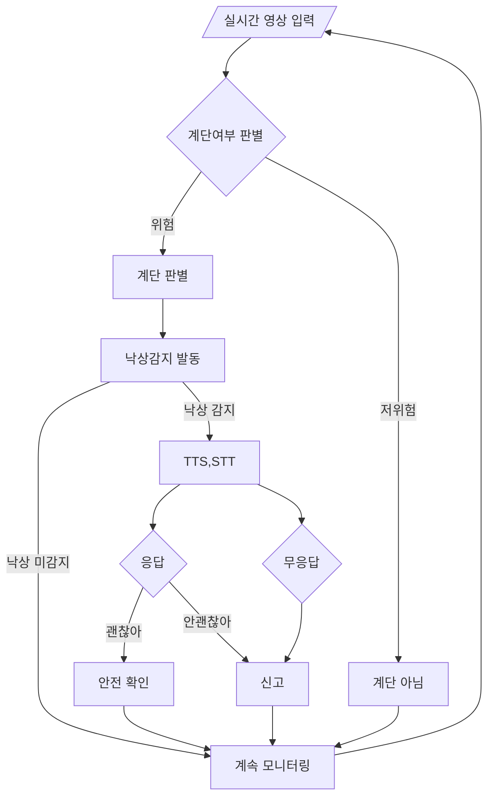

# SafeStep
### Intelligent Fall Detection & Location-Aware Emergency Response System

**MediaPipe · ResNet18 · TTS/STT · Real-time Vision**

<br>

[](https://www.python.org/)
[](https://pytorch.org/)
[](https://mediapipe.dev/)
[](https://opencv.org/)
[](LICENSE)

## Table of Contents

- [Overview](#overview)
- [system-architecture](#system-architecture)
- [emergency-protocols](#emergency-protocol)
- [project-structure](#project-structure)
- [requirements](#requirements)
- [usage](#usage)
- [#tech-stack](#tech-stack)
- [license](#license)

## Overview

SafeStep은 카메라 영상을 분석하여 세 가지 핵심 기능을 파이프라인으로 연결합니다.

1. **계단 인식 (CNN)** — 현재 카메라에 비치는 장소가 계단인지 평지인지 분류합니다.
2. **낙상 감지 (MediaPipe)** — 계단으로 판별된 경우, 사람의 관절 좌표를 추적하여 낙상 여부를 판정합니다.
3. **응급 상호작용 (STT/TTS)** — 낙상이 확정되면 음성으로 사용자의 상태를 확인하고, 필요시 자동으로 119에 신고합니다.

## System Architecture

```
카메라 (실시간 프레임)
    │
    ▼
┌─────────────────────┐
│   predict.py        │  CNN (stair_classifier.pth)
│   is_stair(frame)   │──── 계단? / 평지? → 응급 프로토콜 분기 결정
└────────┬────────────┘
         │ 낙상 감지 ▼
┌─────────────────────┐
│  fall_detection.py  │  MediaPipe Pose
│  process_fall_      │──── 낙하 속도 / 기울기 / 종횡비
│  detection()        │     → 낙상 판정
└────────┬────────────┘
         │ 낙상 확정 시 ▼
┌─────────────────────┐
│  stt_tts_           │   Google STT + gTTS
│  interaction.py     │──── "괜찮으세요?" → 응답 분석
│  handle_fall()      │     → 신고 / 모니터링 / 종료
└─────────────────────┘
```

## Emergency Protocol

낙상이 감지된 후의 신고 판단 흐름은 아래와 같습니다.


```mermaid
flowchart TD
    A[/실시간 영상 입력/] --> B{계단여부 판별}

    B -->|위험| C[계단 판별]
    B -->|저위험| D[계단 아님]

    C --> E[낙상감지 발동]
    E -->|낙상 감지| F[TTS,STT]
    E -->|낙상 미감지| M[계속 모니터링]

    F --> G{응답}
    F --> H{무응답}

    G -->|괜찮아| I[안전 확인]
    G -->|안괜찮아| J[신고]

    H --> J
    I --> M
    J --> M

    D --> M
    M --> A
```

## Project Structure

```
SafeStep/
├── data/                    # 학습 데이터셋
│   ├── stair/               # 계단 이미지
│   └── ground/              # 평지 이미지
├── main.py                  # 메인 실행 파일 (전체 파이프라인 통합)
├── predict.py               # CNN 기반 계단/평지 분류 추론
├── fall_detection.py        # MediaPipe 기반 낙상 감지 + 움직임 모니터링
├── stt_tts_interaction.py   # STT/TTS 응급 상호작용 및 신고 프로토콜
├── train_model.py           # CNN 모델 학습 스크립트
├── predict_video.py         # 영상 파일 대상 계단 분류 테스트
├── convert.py               # 데이터 전처리/변환 유틸리티
├── stair_classifier.pth     # 학습된 CNN 모델 가중치
├── data/                    # 학습 데이터셋
└── LICENSE                  # MIT License
```

## Requirements

```
Python >= 3.8
```

| 패키지 | 용도 |
|---|---|
| `opencv-python` | 웹캠 영상 입력 및 화면 렌더링 |
| `mediapipe` | 실시간 인체 관절 좌표 추출 (Module 1) |
| `numpy` | 관절 좌표 수치 계산 |
| `torch` | PyTorch 딥러닝 프레임워크 (Module 2) |
| `torchvision` | ResNet18 사전학습 모델 로드 |
| `Pillow` | 이미지 전처리 |
| `pillow-heif` | HEIF/HEIC 확장자 이미지 호환 |
| `SpeechRecognition` | STT — 음성을 텍스트로 변환 (Module 3) |
| `gTTS` | TTS — 텍스트를 음성으로 변환 |
| `pygame` | TTS 음성 파일 재생 |
| `PyAudio` | 마이크 하드웨어 접근 |

```bash
pip install opencv-python mediapipe numpy torch torchvision Pillow pillow-heif SpeechRecognition gTTS pygame PyAudio
```

> **Note**: 음성 인식을 사용하려면 마이크가 연결되어 있어야 하며, Google STT API 사용을 위해 인터넷 연결이 필요합니다.

## Usage

### 1️. Git 설치 확인

터미널을 열고 아래 명령어로 Git이 설치되어 있는지 확인하세요:

```bash
git --version
```

> Git이 없다면 [https://git-scm.com/downloads](https://git-scm.com/downloads) 에서 먼저 설치하세요.

---

### 2️. 프로젝트 다운로드

#### 방법 1: Git Clone (권장)

> **Git Clone이란?**  
> 원격 GitHub 저장소의 모든 파일과 코드를 내 컴퓨터로 복사해오는 명령어입니다.  
> 아래 명령어 한 줄로 프로젝트 전체를 내려받을 수 있습니다.

```bash
# 원하는 폴더로 이동 후 아래 명령어 입력
git clone https://github.com/lce2005/SafeStep.git

# 클론된 폴더로 이동
cd SafeStep
```

#### 방법 2: ZIP 파일 다운로드 (Git 없이 간단하게)

1. [https://github.com/lce2005/SafeStep](https://github.com/lce2005/SafeStep) 접속
2. 초록색 **`<> Code`** 버튼 클릭
3. **`Download ZIP`** 클릭하여 다운로드
4. 다운로드된 ZIP 파일 압축 해제
5. 압축 해제된 `SafeStep` 폴더를 터미널에서 열기

---

### 3️. 가상환경 생성 (권장)

다른 프로젝트와 패키지 충돌을 방지하기 위해 가상환경 사용을 권장합니다.

**Anaconda 사용 시 (권장):**
```bash
conda create -n safestep python=3.8 -y
conda activate safestep
```

**venv 사용 시:**
```bash
# 가상환경 생성
python -m venv venv

# 가상환경 활성화
source venv/bin/activate        # macOS / Linux
venv\Scripts\activate           # Windows
```

---

### 4️. 패키지 설치

```bash
pip install opencv-python mediapipe numpy torch torchvision Pillow pillow-heif SpeechRecognition gTTS pygame PyAudio
```

> **PyAudio 설치 오류 시 (Windows)**:
> ```bash
> pip install pipwin
> pipwin install pyaudio
> ```
>
> **PyAudio 설치 오류 시 (macOS)**:
> ```bash
> brew install portaudio
> pip install pyaudio
> ```

---

### 5️. 학습된 모델 가중치 배치

`stair_classifier.pth` 파일을 프로젝트 루트 디렉토리에 위치시킵니다:

```
SafeStep/
├── stair_classifier.pth      ← 여기에 배치
├── main.py
├── fall_detection.py
├── stt_tts_interaction.py
├── train_model.py
├── predict.py
├── predict_video.py
└── ...
```

---

### 6️. 실행

```bash
python main.py
```

웹캠이 자동으로 켜지며 실시간 낙상 감지 및 장소 분류가 시작됩니다.

> **종료**: 실행 중 `esc` 키를 누르면 종료됩니다.

`fall_detection.py`에서 조정할 수 있는 주요 임계값입니다.

| 파라미터 | 기본값 | 설명 |
|---|---|---|
| `TILT_ANGLE_THRESH` | 50 | 어깨-골반 라인 각도 |
| `ASPECT_THRESH` | 1.5 | 바운딩 박스 세로/가로 비율 |
| `FALL_FRAMES` | 10 | 낙상 연속 판정에 필요한 프레임 수 |

조건이 동시에 충족되고, `FALL_FRAMES` 프레임 연속으로 유지될 때 최종 낙상으로 판정합니다.

## Tech Stack

| 영역 | 기술 |
|---|---|
| 계단 분류 | PyTorch CNN (`stair_classifier.pth`) |
| 낙상 감지 | MediaPipe Pose (관절 좌표 추적) |
| 음성 인식 | Google Speech Recognition API |
| 음성 출력 | Google Text-to-Speech (gTTS) |
| 영상 처리 | OpenCV |

## License

This project is licensed under the [MIT License](LICENSE).
