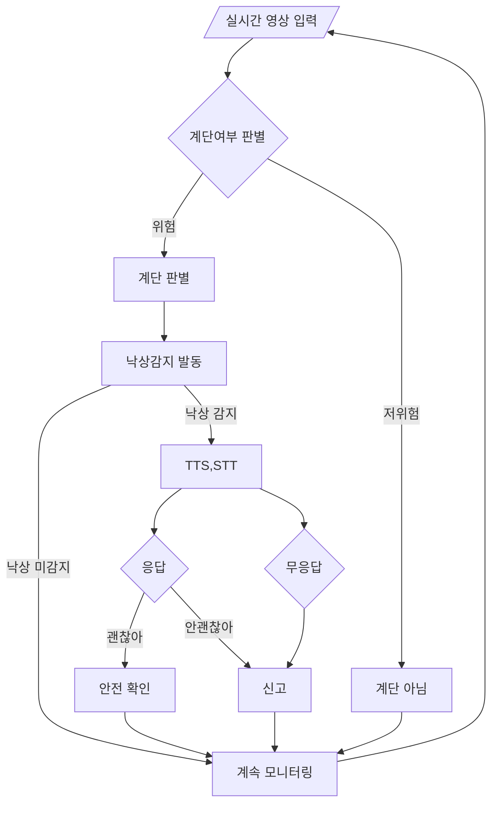

<div align="center">

# SafeStep
### Intelligent Fall Detection & Location-Aware Emergency Response System

**MediaPipe · ResNet18 · TTS/STT · Real-time Vision**

<br>

[](https://www.python.org/)
[](https://pytorch.org/)
[](https://mediapipe.dev/)
[](https://opencv.org/)
[](LICENSE)

## Overview

SafeStep은 카메라 영상을 분석하여 세 가지 핵심 기능을 파이프라인으로 연결합니다.

1. **계단 인식 (CNN)** — 현재 카메라에 비치는 장소가 계단인지 평지인지 분류합니다.
2. **낙상 감지 (MediaPipe)** — 계단으로 판별된 경우, 사람의 관절 좌표를 추적하여 낙상 여부를 판정합니다.
3. **응급 상호작용 (STT/TTS)** — 낙상이 확정되면 음성으로 사용자의 상태를 확인하고, 필요시 자동으로 119에 신고합니다.

## System Architecture

```
카메라 (실시간 프레임)
    │
    ▼
┌─────────────────────┐
│   predict.py        │  CNN (stair_classifier.pth)
│   is_stair(frame)   │──── 계단? / 평지? → 응급 프로토콜 분기 결정
└────────┬────────────┘
         │ 낙상 감지 ▼
┌─────────────────────┐
│  fall_detection.py  │  MediaPipe Pose
│  process_fall_      │──── 낙하 속도 / 기울기 / 종횡비
│  detection()        │     → 낙상 판정
└────────┬────────────┘
         │ 낙상 확정 시 ▼
┌─────────────────────┐
│  stt_tts_           │   Google STT + gTTS
│  interaction.py     │──── "괜찮으세요?" → 응답 분석
│  handle_fall()      │     → 신고 / 모니터링 / 종료
└─────────────────────┘
```

## Emergency Protocol

낙상이 감지된 후의 신고 판단 흐름은 아래와 같습니다.


```mermaid
flowchart TD
    A[/실시간 영상 입력/] --> B{계단여부 판별}

    B -->|위험| C[계단 판별]
    B -->|저위험| D[계단 아님]

    C --> E[낙상감지 발동]
    E -->|낙상 감지| F[TTS,STT]
    E -->|낙상 미감지| M[계속 모니터링]

    F --> G{응답}
    F --> H{무응답}

    G -->|괜찮아| I[안전 확인]
    G -->|안괜찮아| J[신고]

    H --> J
    I --> M
    J --> M

    D --> M
    M --> A
```

## Project Structure

```
SafeStep/
├── main.py                  # 메인 실행 파일 (전체 파이프라인 통합)
├── predict.py               # CNN 기반 계단/평지 분류 추론
├── fall_detection.py        # MediaPipe 기반 낙상 감지 + 움직임 모니터링
├── stt_tts_interaction.py   # STT/TTS 응급 상호작용 및 신고 프로토콜
├── train_model.py           # CNN 모델 학습 스크립트
├── predict_video.py         # 영상 파일 대상 계단 분류 테스트
├── convert.py               # 데이터 전처리/변환 유틸리티
├── stair_classifier.pth     # 학습된 CNN 모델 가중치
├── data/                    # 학습 데이터셋
└── LICENSE                  # MIT License
```

## Requirements

- Python 3.8+
- OpenCV
- MediaPipe
- PyTorch
- SpeechRecognition
- gTTS
- pygame

```bash
pip install opencv-python mediapipe torch torchvision SpeechRecognition gTTS pygame numpy
```

> **Note**: 음성 인식을 사용하려면 마이크가 연결되어 있어야 하며, Google STT API 사용을 위해 인터넷 연결이 필요합니다.

## Usage

### 전체 시스템 실행

```bash
python main.py
```

카메라가 자동으로 켜지며, ESC 키를 누르면 종료됩니다.

### STT/TTS 단독 테스트

키보드 입력으로 응급 대화 흐름을 테스트할 수 있습니다.

```bash
# 콘솔 모드 (키보드 입력으로 시뮬레이션)
python stt_tts_interaction.py --mode console

# 음성 모드 (실제 마이크 + 스피커)
python stt_tts_interaction.py --mode voice

# 위험 장소(계단) 시나리오 테스트
python stt_tts_interaction.py --mode console --danger
```

### 모델 학습

```bash
python train_model.py
```

## Detection Parameters

`fall_detection.py`에서 조정할 수 있는 주요 임계값입니다.

| 파라미터 | 기본값 | 설명 |
|---|---|---|
| `FALL_VEL_THRESH` | 0.28 | 초당 y축 낙하 속도 임계값 |
| `TILT_ANGLE_THRESH` | 60° | 어깨-골반 기울기 각도 (낮을수록 누운 상태) |
| `ASPECT_THRESH` | 1.3 | 바운딩 박스 세로/가로 비율 |
| `FALL_FRAMES` | 30 | 낙상 연속 판정에 필요한 프레임 수 |

세 가지 조건(빠른 낙하 + 낮은 기울기 + 낮은 종횡비)이 동시에 충족되고, `FALL_FRAMES` 프레임 연속으로 유지될 때 최종 낙상으로 판정합니다.

## Tech Stack

| 영역 | 기술 |
|---|---|
| 계단 분류 | PyTorch CNN (`stair_classifier.pth`) |
| 낙상 감지 | MediaPipe Pose (관절 좌표 추적) |
| 음성 인식 | Google Speech Recognition API |
| 음성 출력 | Google Text-to-Speech (gTTS) |
| 영상 처리 | OpenCV |

## License

This project is licensed under the [MIT License](LICENSE).
